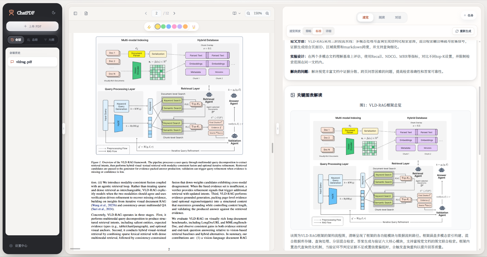
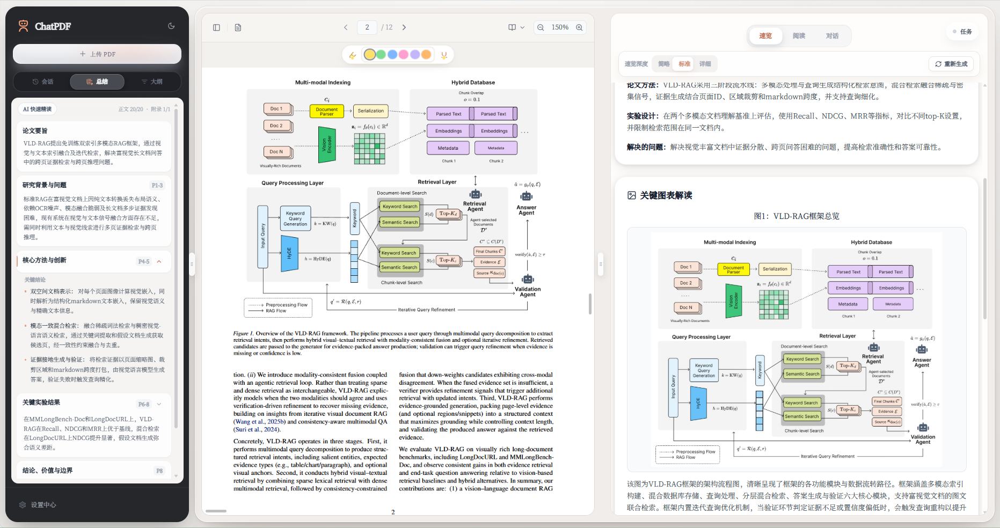
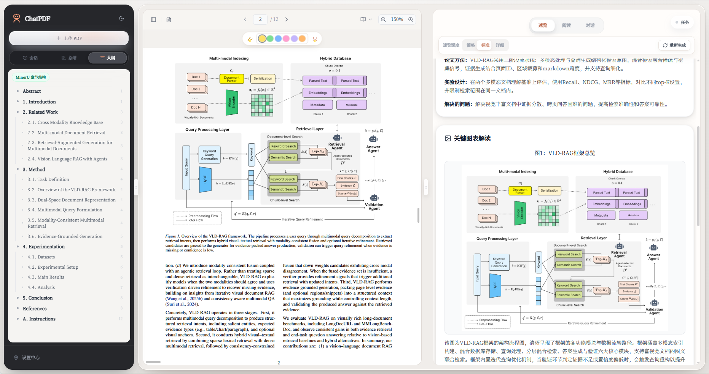
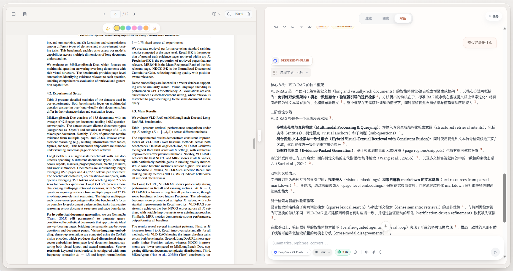

# ChatPDF Pro

<div align="center">

[](https://github.com/juyou4/ChatPDF-Pro/releases)
[](LICENSE)
[](https://react.dev)
[](https://www.python.org)

**A desktop AI reader for research papers and long documents**

Parse once. Overview, summary, outline, translation, and chat use the same document structure.

[Preview](#app-preview) · [Parsing Routes](#parsing-routes) · [Core Capabilities](#core-capabilities) · [Quick Start](#quick-start) · [Evaluation](#ragas-evaluation) · [中文](README.md)

</div>

---

## Overview

ChatPDF Pro puts the PDF, structured reading tools, and citation-backed chat in one workspace. Choose MinerU or local parsing before upload. Once parsing finishes, overview, full-document summary, outline, translation, and RAG chat all read the same block index. Citations in an answer can jump back to the source page.

Documents and chat history are stored locally by default. The MinerU route uploads the PDF to the configured MinerU service. Cloud chat, embedding, and vision models receive the content required for the requested task. Web search sends queries only when enabled. For the smallest external-data footprint, use local parsing, local models, and turn web search off.

---

## App Preview

### Full-Document Overview

<div align="center">

<br />
<sub>Full-document guide, key-figure analysis, and the source PDF side by side</sub>
</div>

The Overview panel reads the whole document and produces a summary, terminology, method and experiment notes, key-figure analysis, and conclusions. It is not a summary of the current page.

| Depth | Best for | Scope |
| --- | --- | --- |
| Brief | Deciding whether a paper is worth a closer read | 3 terms and up to 2 key figures |
| Standard | Everyday reading; the default | 5 terms and up to 3 key figures |
| Detailed | Close reading of methods, experiments, and figures | 8 terms and up to 5 key figures; uses more context and tokens |

Completed overviews are cached by document version, parsing route, model, and depth. Switching views or reopening a document reuses the cache. Use **Regenerate** when you need a fresh result.

### Full-Document Summary

<div align="center">

<br />
<sub>A chapter-based summary with page anchors</sub>
</div>

The Summary view organises the full paper by section. Page labels jump back to the source, while coverage counters show whether the main text and appendices were included. The Overview panel can remain open on the right for quick comparison with figure analysis.

### Outline Navigation

<div align="center">

<br />
<sub>Nested section structure linked to the PDF</sub>
</div>

With MinerU, the outline uses the parsed section hierarchy, numbering, and page anchors directly. Selecting a heading navigates to the matching location in both paged and continuous reading modes.

### Translation and Notes

<div align="center">

<br />
<sub>Page translation, floating translations, and free-form notes</sub>
</div>

The Reading view keeps page translation and notes in one workspace. The two widgets can be reordered by dragging, resized as columns, collapsed, or moved into a full-width row. Translations are cached per block and support full-document pretranslation, source/translation switching, and retrying failed blocks. A note can start from selected PDF text or as a blank note on the current page.

### Chat with Evidence

<div align="center">

<br />
<sub>Document Q&amp;A, collapsible reasoning, and citations linked to the PDF</sub>
</div>

Inline `[1]` and `[2]` citations refer only to evidence returned during the current run and jump back to the PDF. Reasoning is collapsed by default, and formulas, Markdown, and Mermaid render in place.

- **Privacy-safe distribution** - The installer contains only the renderer, Electron main process, and frozen backend runtime. It never ships uploaded documents, chat history, generated overview/outline/summary caches, indexes, logs, `.env` files, or API keys.
- **Separate runtime storage** - On first launch, the desktop app creates its runtime data in the operating system's user-data location. Installing or upgrading does not delete existing local data, and that data is never copied back into the installer.

---

## Parsing Routes

Choose a route before upload. Once parsing starts, the application does not silently switch the document to another parser.

| Route | Best for | Behaviour |
| --- | --- | --- |
| MinerU (default) | Scans, formulas, tables, and complex layouts | Uploads the PDF to the configured MinerU service; text, structure, visuals, and the RAG index all come from MinerU |
| Local | Native-text PDFs or workflows that should stay on the machine where possible | Uses PyMuPDF, pdfplumber, OpenDataLoader, and DocLayout-YOLO; prompts for local components on first use |

Both routes publish the same block-index contract. Overview, summary, outline, translation, and chat accept only the currently published route and document version. OCR and YOLO are local-route helpers, not separate parsing routes.

---

## Core Capabilities

### Reading Workspace

- PDF.js rendering with paged or continuous reading, zoom, page navigation, text selection, and highlights.
- Summary, outline, overview, translation, and notes can remain available in the same workspace.
- Translation and note widgets support drag-to-reorder, split columns, full-width rows, collapsing, and height adjustment. The layout is saved locally.
- Translations are saved incrementally per block. If a long pretranslation run stops, completed blocks remain and only missing or failed blocks need another request.
- MinerU upload, parsing, result download, and index construction expose progress and can be cancelled or retried.

### Notes

- Write a free-form note on the current page, or select text in the PDF first to create a quotation note with the source excerpt attached.
- Quotation notes retain the page number and selection coordinates. **Locate source** returns to the page and highlights the original text range.
- The editor uses in-place Markdown preview: the active line shows its Markdown marks, while other lines are typeset as headings, lists, emphasis, quotations, and other formatted content.
- Notes support headings, lists, task lists, bold, italics, strikethrough, blockquotes, links, code blocks, GFM tables, and LaTeX. Saved notes render syntax-highlighted code and KaTeX formulas.
- The panel follows the current PDF page and shows that page's notes. Saved notes are stored locally per document and remain editable or removable; they are not sent to the backend or synchronised to a cloud service.

### Retrieval and Citations

- BM25, chunk vectors, and semantic-group vectors are fused with RRF to cover exact terms, semantic matches, and section context.
- The Agent can search the document, read a complete section, expand around a hit, and stop when another round adds no evidence.
- Table retrieval keeps headers, target rows, and comparison rows together. Formula queries normalise LaTeX and OCR variants before retrieval.
- Final citations must come from evidence actually returned by tools in the current run. Unknown or mismatched evidence IDs are removed.
- The Trace panel shows retrieval steps, tool calls, and the stopping reason. Answer-risk checks appear separately.

### Figures and Vision

- MinerU figures, tables, and formulas are published as visual assets with page coordinates and document-version identity.
- Overview, document chat, and visual search reuse those assets instead of cropping the same figure independently.
- If the main parse lacks a figure region, the local route can use DocLayout-YOLO to locate it. A vision model is called only for regions that need interpretation or verification.
- Optional numeric-table verification reports confirmed, conflict, or indeterminate; it never overwrites extracted text.

### Models and Web Research

- Supports OpenAI, Anthropic, Gemini, Grok, DeepSeek, Kimi, Qwen, GLM, MiniMax, Ollama, and OpenAI-compatible endpoints.
- Chat, embedding, reranking, and vision models are configured independently. A text-only model is not silently used for vision.
- Reasoning controls follow each model's capabilities, such as `off`, `minimal`, `low`, `medium`, `high`, `xhigh`, `max`, or `ultra`. Unsupported levels are not sent to the provider.
- Web search has Off, Auto, and Force modes. In Auto mode, the Agent decides whether to search and plans the query instead of submitting the full user message verbatim.
- Web evidence is labelled separately from document evidence. Authorised public pages, GitHub content, and public YouTube transcripts can be read after search.

### Cache and Security

- Artifacts are bound to the parsing route, parse generation, and source-file hash. Reparse or route changes invalidate stale overview, summary, translation, and RAG caches.
- The desktop backend binds to `127.0.0.1` and protects APIs with a session token.
- External pages and model output are treated as untrusted content and cannot redefine system instructions or forge document citations.

---

## RAGAS Evaluation

The project uses a fixed 26-question, multi-paper set for development regression testing. This is not a public leaderboard. Results are directly comparable only when the question set and `index_source` match.

| Index | Faithfulness | Answer Relevancy | Context Precision | Context Recall | Answer Correctness |
| --- | ---: | ---: | ---: | ---: | ---: |
| A1 `pdf_native` | 0.8173 | 0.4268 | 0.7033 | 0.8077 | 0.7211 |
| Current `mineru` | **0.9695** | 0.3399 | **0.8765** | **0.9615** | **0.7528** |

Results for the 17-question `numeric_table` subset:

| Index | Faithfulness | Context Precision | Context Recall | Answer Correctness |
| --- | ---: | ---: | ---: | ---: |
| A1 `pdf_native` | 0.8300 | 0.8140 | 0.8820 | 0.7600 |
| Current `mineru` | **0.9733** | **0.9533** | **1.0000** | **0.7986** |

The current MinerU index improves faithfulness, context precision, context recall, and answer correctness over A1. Answer Relevancy falls from 0.4268 to 0.3399; the metric is sensitive to short numeric answers, so the raw regression is reported rather than hidden. See the [MinerU RAG index upgrade record](docs/mineru-rag-index-upgrade-plan.md) for the complete experiment history.

---

## Quick Start

### Option 1: Download Desktop Client (Recommended)

Download the latest Windows installer from [Releases](https://github.com/juyou4/ChatPDF-Pro/releases). The published package includes both the frontend and Python backend, so Node.js and Python are not required on the target machine.

### Build a Clean Windows Installer

The following writes a build identity manifest, rebuilds the frontend, freezes the Python backend, and produces an x64 NSIS installer:

```bash
scripts/build-all.bat
```

The default output is in `electron/release/`. Installer filenames include the app version and Git short SHA, and the build writes `release-manifest.json` plus `.sha256` checksum files. Packaging rules exclude `data/`, `uploads/`, `logs/`, `cache/`, `history/`, `memory/`, vector and semantic indexes, test/course/evaluation directories, PDFs, database/serialized artifacts, `.env` files, logs, and API-key-named files at both the PyInstaller and Electron resource-copy stages. Do not manually copy a local user-data directory or development `data/` directory into the release output.

`version.json` at the repository root is the single release metadata source. `/version`, `/health`, `/capabilities`, the Electron package version, and the frontend public version must match it. Before release, run:

```bash
python scripts/release_metadata.py --check
```


### Option 2: Run from Source

Requirements:

- Python 3.10+
- Node.js `^20.19.0` or `>=22.12.0`
- npm

Windows:

```powershell
git clone https://github.com/juyou4/ChatPDF-Pro.git
cd ChatPDF-Pro
.\start.bat
```

Linux / macOS:

```bash
git clone https://github.com/juyou4/ChatPDF-Pro.git
cd ChatPDF-Pro
chmod +x start.sh
./start.sh
```

The launcher installs the base runtime and opens `http://localhost:3000`. On `main`, it first attempts to pull the latest code. Local-parser components are installed only when the local route is selected for the first time.

### Manual Start

Backend:

```bash
cd backend
python -m pip install -r requirements-core.txt
python app.py
```

In another terminal, start the frontend:

```bash
cd frontend
npm install
npm run dev
```

The frontend uses `http://localhost:3000`; the backend uses `http://127.0.0.1:8000`.

---

## First-Time Configuration

All configuration lives in **Settings Center** at the bottom left.

| Setting | Required | Purpose |
| --- | --- | --- |
| Chat model | Yes | Chat, summary, overview, and translation |
| Embedding model | Yes | Build and query the document vector index |
| MinerU service | Required for the default route | Upload PDFs and obtain structured text, sections, and visual assets |
| Vision model | Optional | Figure interpretation and visual table verification |
| Web search | Optional | Retrieve current information outside the document with public source links |

Recommended first run:

1. Configure a chat model and an embedding model.
2. Choose MinerU or Local next to the upload button.
3. Upload a PDF and wait for parsing and indexing to finish in the task panel.
4. Start with Overview or Outline, then move to Reading or Chat.

When an answer looks uncertain, open its citations in the PDF and inspect the Trace panel for the tools and evidence used. Regenerate overview, summary, or outline explicitly; switching views is not a regeneration trigger.

---

## Development

### Stack

| Layer | Main technologies |
| --- | --- |
| Frontend | React 18.3, Vite 7.3, Tailwind CSS 3.4, Motion 12 |
| PDF and content rendering | react-pdf 9, PDF.js 4.8, React Markdown, KaTeX / MathJax, Mermaid |
| Backend | Python 3.10+, FastAPI 0.115, Uvicorn, Pydantic 2 |
| Documents and retrieval | PyMuPDF 1.24, pdfplumber 0.11, FAISS 1.9, LangChain 0.3, jieba |
| Local parser extensions | OpenDataLoader, DocLayout-YOLO, Tesseract |
| Desktop | Electron 28, electron-builder 24, PyInstaller |

### Common Checks

Frontend:

```bash
cd frontend
npm run lint
npm run test
npm run check:streaming
```

Backend:

```bash
cd backend
python -m pytest
```

Windows desktop package:

```bash
cd electron
npm run package:win
```

---

## Project Layout

<details>
<summary>Expand directory tree</summary>

```text
ChatPDF/
├── frontend/
│   └── src/
│       ├── components/    # PDF, overview, reading, chat, and settings UI
│       ├── hooks/         # Document, message, streaming, and UI state
│       ├── contexts/      # Model, reading, font, and global settings
│       └── config/        # Provider and system-model definitions
├── backend/
│   ├── app.py             # FastAPI entry point
│   ├── routes/            # Document, chat, search, and model APIs
│   ├── services/          # Parsing, indexing, Agent, vision, translation, cache
│   ├── tests/             # Backend regression and property tests
│   └── requirements*.txt
├── electron/              # Desktop process, preload bridge, packaging
├── docs/                  # Design notes, evaluation records, README images
├── scripts/               # Launch, build, and diagnostic scripts
├── start.bat
└── start.sh
```

</details>

---

## FAQ

### Is MinerU required?

No. MinerU is the default and is recommended for scans and complex layouts. Native-text PDFs can use the local route. On first use, the local route prompts for its layout model and OCR runtime. Java 11+ is only needed for optional OpenDataLoader cleanup.

### Why can I still see old documents or chat history after updating?

The installer contains no user history. When installed or upgraded under the same Windows account, the desktop app intentionally keeps using that account's existing application-data directory, so previously saved local records remain visible. A new OS account or a device with no prior app data starts with an empty library.

### The PDF does not display in Web mode. What should I check?

Confirm that the backend is running on the default `8000` port, then check the browser console for CORS or network-interception errors.

### MinerU upload or parsing never starts. What should I check?

Run the connection test in **Settings Center → Parsing → MinerU Service**. Official direct mode ignores normal HTTP proxy environment variables, but a system-level virtual network adapter can still change the public exit IP. If MinerU rejects that exit, disable the adapter or route `mineru.net` directly. Worker mode also requires the matching upload, polling, and download endpoints.

### Why does reopening a document not regenerate Overview?

That is expected. A completed overview is cached by document version, route, model, and depth. Use **Regenerate** for a fresh result. Reparse, route changes, or relevant model changes invalidate the old cache automatically.

### Why are Overview, Summary, or Chat temporarily unavailable?

They open only after the main parse and RAG index are published together. The task panel shows upload, parse, download, and indexing progress. If parsing fails or is cancelled, retry parsing rather than generating downstream content against an older index.

### What data leaves the machine?

The local document library and chat history stay on the machine by default. MinerU receives the PDF. Cloud models receive the text or images needed for the selected task. Web search sends a query and includes document context only with explicit permission. Use local parsing, local chat and embedding models, and disable web search to minimise external transmission.

### Ollama refuses the connection. What should I do?

Check that Ollama is running and allows requests from ChatPDF's origin. If Web mode is blocked by CORS, configure `OLLAMA_ORIGINS` according to Ollama's documentation. Desktop mode should use a local endpoint.

### Formulas do not render correctly. What should I do?

Switch between KaTeX and MathJax in Settings Center. KaTeX is faster; MathJax handles more complex LaTeX.

---

## Recent Work

### v3.1.0
- MinerU full-route parsing identity, downstream cache invalidation, and shared visual assets.
- Reading workspace UI refinements, persistent font settings, markdown note editing, and toolbar layout improvements.
- Engineering identity cleanup: unified version metadata, reproducible build manifest, privacy-safe packaging checks, and runtime log directory alignment.


- The MinerU or Local primary route is fixed before upload, and every downstream feature uses the same parse identity.
- MinerU sections, figures, and tables publish into one block index shared by overview, reading, and chat.
- The retrieval Agent can read full sections, expand around evidence, authorise citations, and stop when evidence is saturated.
- Web research uses Agent-planned queries and can continue reading authorised public sources.
- Summary, outline, translation, notes, task progress, and answer streaming have been revised together.
- Cache invalidation, cancellation, stale-generation write guards, and desktop release-data filtering have been tightened.

The current version is [v3.1.0](https://github.com/juyou4/ChatPDF-Pro/releases/tag/v3.1.0). See the [commit history](https://github.com/juyou4/ChatPDF-Pro/commits/main/) and Releases for complete changes.

---

## Contributing

Issues and pull requests are welcome. Reproduce the problem first, then run the checks relevant to the changed area before submitting.

1. Fork the repository.
2. Create a branch: `git checkout -b feature/my-change`.
3. Commit: `git commit -m "feat: describe the change"`.
4. Push: `git push origin feature/my-change`.
5. Open a pull request.

---

## Acknowledgments

The semantic-group and multi-granularity retrieval design was informed by [Paper Burner X](https://github.com/Feather-2/paper-burner-x). See [THIRD_PARTY_NOTICES.md](THIRD_PARTY_NOTICES.md) for dependency and attribution details.

---

## License

This project is licensed under the MIT License. See [LICENSE](LICENSE).
